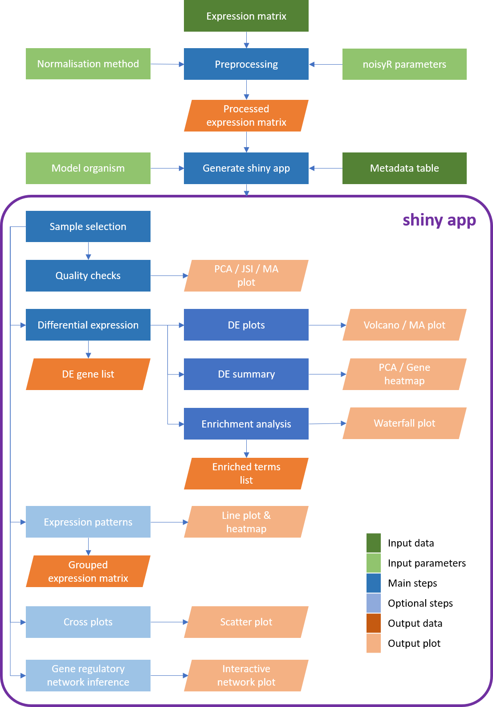
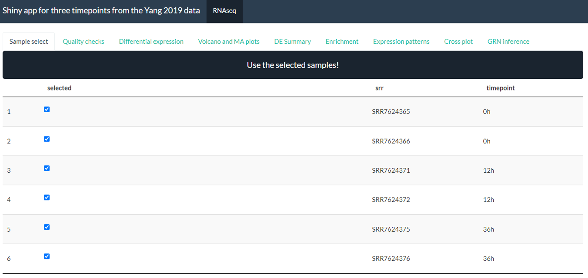

# *bulkAnalyseR*: An easy way to analyse and share bulk mRNA-Seq data

[comment]: <[](https://github.com/r-hub/cranlogs.app)>
[comment]: <[](https://github.com/r-hub/cranlogs.app)>

<div style="text-align: justify"> 

Bulk mRNA-seq experiments are essential for exploring a wide range of biological questions. To bring closer the data analysis to its interpretation and facilitate both interactive, exploratory tasks and the sharing of (easily accessible) information, we present *bulkAnalyseR* an R package that offers a seamless, customisable solution for most bulk RNAseq datasets. By integrating state-of-the-art approaches without relying on extensive computational support, and replacing static images with interactive panels, our aim is to further support and strengthen the reusability of data. *bulkAnalyseR* enables standard analyses of bulk data, using an expression matrix as starting point. It presents the outputs of various steps in an interactive web-based interface, making it easy to generate, explore and verify hypotheses.  Moreover, the app can be easily shared and published, incentivising research reproducibility and allowing others to explore the same processed data and enhance the biological conclusions.

[comment]: <Preprint: AAA>



*Workflow diagram of the **bulkAnalyseR** pipeline*

## Preprocessing step

### Defining expression matrix and metadata

To create a shiny app using *bulkAnalyseR*, you need an expression matrix and a metadata table loaded. 

The expression matrix should have genes on the rows (with the Ensembl ID as the row name) and samples on the columns. 

The first column of the metadata table must match the column names of the expression matrix. The other columns of the metadata table contain other pieces of information about the samples e.g. timepoint, treatment groups you want to compare between. 

For example, if you had this expression matrix (from [2019 paper by Yang et al](https://www.sciencedirect.com/science/article/pii/S2405471219301152)):

|    |SRR7624365   |  SRR7624366 | SRR7624371   | SRR7624372  | SRR7624375  | SRR7624376 |
|---|---|---|---|---|---|--- |
|ENSMUSG00000102693| 2  | 0  | 0  | 0  | 0  | 0  |
|ENSMUSG00000064842| 0  | 0  | 0  | 0  | 0  | 0  |
|ENSMUSG00000051951| 6  | 4  | 2  | 0  | 47 | 37 |
|| ...  | ...  | ...  | ...  | ... | ... |

Then you could have this metadata table:

| srr        | timepoint |
| ---        | ---       |
| SRR7624365 | 0h        |
| SRR7624366 | 0h        |
| SRR7624371 | 12h       |
| SRR7624372 | 12h       |
| SRR7624375 | 36h       |
| SRR7624376 | 36h       |

### Denoising and normalisation

Before using the expression matrix to create our shiny app, some preprocessing should be performed. *bulkAnalyseR* contains the function **preprocessExpressionMatrix** which takes the expression matrix as input then denoises the data using [*noisyR*](https://github.com/Core-Bioinformatics/noisyR) and normalises using either quantile (by default) or RPM normalisation (specified using *normalisation.method* parameter).

It is not recommended to use data which has not been denoised and normalised as input to *generateShinyApp*. You can also perform your own preprocessing outside *preprocessExpressionMatrix*.

Main function: *preprocessExpressionMatrix()* 

Supporting function: *noisyr_counts_with_plot()*

## Generating shiny app

The central function in *bulkAnalyseR* is **generateShinyApp**. This function creates an app.R file and all required objects to run the app in .rda format in the target directory. The key inputs to **generateShinyApp** are *expression.matrix* (after being processed using *preprocessExpressionMatrix*) and *meta*. You can also specify the title, name for directory where the app should be saved, shiny theme as well as specifying the organism on which your data was generated.

Calling *generateShinyApp* with these parameters will create a folder with your chosen name in which there will be 2 data files *expression_matrix.rda* and *metadata.rda* and *app.R* which defines the app. To see the app, you can call *shiny::runApp()* with the name of the folder and the app will start. The app generated is standalone and can be shared with collaborators or published online through a platform like [shinyapps.io](https://www.shinyapps.io/). This provides an easy way for anyone to explore the data and verify the conclusions, increasing access and promoting reproducibility of the bioinformatics analysis.

By default, the app will have 8 panels: Sample select, Quality checks, Differential expression, Volcano and MA plots, DE summary, Expression patterns, Cross plots, GRN inference. You can choose to remove one or more panels using the *default.panels* parameter. 

By default, the app will look like this:



*Screenshot from sample bulkAnalyseR app*

[comment]: <See [vignette](www.vignettelink.com) for more details on the individual panels.>

You can also add custom extra panels and data using the *panels.extra* and *data.extra* parameters.

Main function: *generateShinyApp()* 

Panel functions (with UI and server components): *sampleSelectPanel*, *QCpanel*, *DEpanel*, *DEplotPanel*, *DEsummaryPanel*, *enrichmentPanel*, *patternPanel*, *crossPanel*, *GRNpanel*

Supporting functions: *DEanalysis_deseq2*, *DEanalysis_edger*, *calculate_condition_mean_sd_per_gene*, *determine_uds*, *expression_heatmap*, *jaccard_heatmap*, *ma_enhance*, *ma_plot*, *make_heatmap_matrix*, *make_pattern_matrix*, *plot_line_pattern*, *plot_pca*, *volcano_enhance*, *volcano_plot*

## Quick Start Guide

A shiny app for the [Yang et al 2019 data](https://www.sciencedirect.com/science/article/pii/S2405471219301152) can be generated using the following code:

```{r}
library(bulkAnalyseR) 

#load expression matrix
expression.matrix <- as.matrix(read.csv(
  system.file("extdata", "expression_matrix.csv", package = "bulkAnalyseR"), 
  row.names = 1
))

#create metadata table
metadata <- data.frame(srr = colnames(expression.matrix), 
                   timepoint = rep(c("0h", "12h", "36h"), each = 2))

#run preprocessing
expression.matrix.preproc <- preprocessExpressionMatrix(expression.matrix)

#create shiny app
shiny.dir <- "shiny_Yang2019"
generateShinyApp(
  expression.matrix = expression.matrix.preproc,
  metadata = metadata,
  shiny.dir = shiny.dir,
  app.title = "Shiny app for three timepoints from the Yang 2019 data",
  organism = "mmusculus",
  org.db = "org.Mm.eg.db"
)

#run shiny app
shiny::runApp(shiny.dir)
```

## Installation guide

*bulkAnalyseR* can be installed from CRAN using *install.packages("bulkAnalyseR")*. You also need to make sure all bioconductor dependencies are also installed.

To install the latest stable development version from GitHub, first install CRAN dependencies as well as *devtools* then use *devtools::install_github("Core-Bioinformatics/bulkAnalyseR")*.

### Required CRAN packages (use *install.packages()*) ###

* utils
* stats
* grDevices
* tibble
* dplyr
* magrittr
* shiny
* shinythemes
* shinyWidgets
* shinyjqui
* shinyjs
* ggplot2
* ggrepel
* ggnewscale
* ggforce
* ggrastr
* RColorBrewer
* glue
* rlang
* noisyr
* matrixStats
* visNetwork
* gprofiler2
* circlize

### Required Bioconductor packages (use *BiocManager::install()*) ###
* preprocessCore
* edgeR
* DESeq2
* AnnotationDBI
* GENIE3
* ComplexHeatmap

### Bioconductor annotation packages (the one for your model organism is required, human and mouse ones are listed here)
* org.Hs.eg.db
* org.Mm.eg.db

</div>

