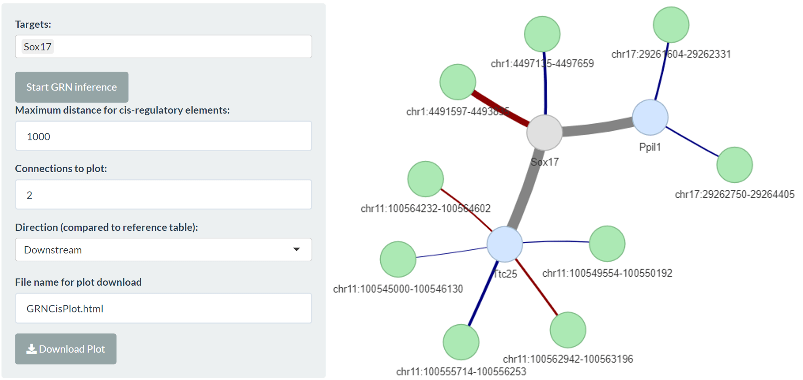

<div style="text-align: justify"> 

```{r options, include = FALSE}
knitr::opts_chunk$set(
  collapse = TRUE,
  comment = "##>"
)
```

## Cis-regulatory integration

*bulkAnalyseR* enables the integration of information involving cis-regulatory elements. A reference expression matrix is chosen, which may or may not be the central expression matrix for one of the full modality panels. A GRN is created on this expression matrix (see [here](https://core-bioinformatics.github.io/bulkAnalyseR/articles/bulkAnalyseR.html) for more information about GRN inference). Elements in the GRN are compared against elements from a second table which are located in proximity (e.g. 1kb, user-defined parameter); the elements in proximity are used to augment the focal GRN. 

As an example, we consider a subset of the mRNAseq and h3k4me3 ChIPseq data from an experiment included in [a 2019 paper by Yang et al](https://www.sciencedirect.com/science/article/pii/S2405471219301152). The preprocessed mRNAseq data is included in the *bulkAnalyseR* package and can be loaded by running:

```{r bulkAnalyseR, include=FALSE}
library("bulkAnalyseR")
```

```{r load Yang 2019 mRNAseq}
exp.yang <- read.csv(
  system.file("extdata", "expression_matrix_preprocessed.csv", package = "bulkAnalyseR"),
  row.names = 1) %>% as.matrix
head(exp.yang)
```

We define a default full modality app for the RNAseq data with an additional column relating to cis-integration so we also need to define a metadata table for the RNAseq data (our reference expression matrix):

```{r metadata}
meta <- data.frame(
  srr = colnames(exp.yang), 
  timepoint = rep(c("0h", "12h", "36h"), each = 2)
)
```

```{r convert type, include = FALSE, eval = FALSE}
meta$srr = as.character(meta$srr)
meta$timepoint = as.character(meta$timepoint)
```

Our reference inputs for the RNAseq data have the following structure:

```{r str gene expression}
str(exp.yang)
str(meta)
```

To identify elements in proximity to genes in this dataset, we also need a table with chromosome, start and stop coordinates for genes. The data needed for the integration step can be found [here](https://github.com/Core-Bioinformatics/bulkAnalyseR/tree/main/exampledata/Yang2019_ChIP).  

```{r gene table coord}
gene.coord.table <- read.csv(
  url('https://raw.githubusercontent.com/Core-Bioinformatics/bulkAnalyseR/master/exampledata/Yang2019_ChIP/gene_coords_GRCm38.p6.csv'),
  row.names = 1)
str(gene.coord.table)
```

For RNAseq, such a table can be produced from the reference gtf. We also need to supply the organism database, here "org.Mm.eg.db" (see [here](https://core-bioinformatics.github.io/bulkAnalyseR/articles/bulkAnalyseR.html) for more information). 

Finally, we need information about the ChIPseq peak coordinates to compare against RNAseq gene coordinates. These can come, for example, from MACS2 peak calling output (narrowPeak files). 

```{r chip coord table}
chip.coord.table <- read.csv(
  url('https://raw.githubusercontent.com/Core-Bioinformatics/bulkAnalyseR/master/exampledata/Yang2019_ChIP/ChIP_peak_coords.csv'),
  row.names = 1)
str(chip.coord.table)
```

The two coordinate tables should always have this structure and chromosome names must match between tables.

To create the integration tab, we need to define the following tibble:

```{r}
cis.integration <- tibble::tibble(
  reference.expression.matrix = 'exp.yang',
  reference.org.db = 'org.Mm.eg.db',
  reference.coord = 'gene.coord.table',
  comparison.coord = 'chip.coord.table',
  reference.table.name = 'mRNAseq',
  comparison.table.name = 'ChIPseq'
)
```

Note that in this table, the names of all tables should be enclosed in quotation marks.

To create the app itself, we use the same call to *generateShinyApp* as [here](https://core-bioinformatics.github.io/bulkAnalyseR/articles/bulkAnalyseR.html) but we add the *cis.integration* argument with this tibble.

```{r generate cis app, eval=FALSE}
generateShinyApp(
  expression.matrix = exp.yang,
  metadata = meta,
  modality = "RNA",
  shiny.dir = "shiny_Yang2019_CisIntegration",
  app.title = "Shiny app for visualisation of three timepoints from the Yang 2019 data",
  organism = "mmusculus",
  org.db = "org.Mm.eg.db",
  cis.integration = cis.integration
)
shiny::runApp('shiny_Yang2019_CisIntegration')
```

The cis-integration tab will look like this:

```{r CisIntegration, echo = FALSE, out.width = "80%"}
 
```

We could instead create an app with two modality tabs, including the ChIPseq expression matrix and cis integration with each of the mRNAseq and ChIPseq as the reference expression matrix like follows:

```{r yang multiple modality, eval= FALSE}
exp.chip <- read.csv(
  url('https://raw.githubusercontent.com/Core-Bioinformatics/bulkAnalyseR/master/exampledata/Yang2019_ChIP/ChIP_expression_matrix_preprocessed.csv'),
  row.names = 1) %>% as.matrix
meta.chip = data.frame(
  id = colnames(exp.chip),
  timepoint = c('0h','12h','36h')
)
cis.integration.2 <- tibble::tibble(
  reference.expression.matrix = c('exp.yang','exp.chip'),
  reference.org.db = c('org.Mm.eg.db','NULL'),
  reference.coord = c('gene.coord.table','chip.coord.table'),
  comparison.coord = c('chip.coord.table','gene.coord.table'),
  reference.table.name = c('mRNAseq','ChIPseq'),
  comparison.table.name = c('ChIPseq','mRNAseq')
)
generateShinyApp(
  expression.matrix = list(exp.yang,exp.chip),
  metadata = list(meta,meta.chip),
  modality = c('RNA','ChIP'),
  shiny.dir = "shiny_Yang2019_CisIntegration2",
  app.title = "Shiny app for visualisation of three timepoints from the Yang 2019 data",
  organism = list("mmusculus",NA),
  org.db = list("org.Mm.eg.db",NA),
  cis.integration = cis.integration.2
)
shiny::runApp('shiny_Yang2019_CisIntegration2')
```

An example app with cis-integration can be found [here](http://bioinf.stemcells.cam.ac.uk:3838/bulkAnalyseR/Yang2019_Integration/).

## Trans-regulatory elements

*bulkAnalyseR* also offers the opportunity to analyse multiple elements which are not related necessarily by proximity but by correlation. For this component, two expression matrices are required, on the same columns. A joint GRN is then calculated on the combined expression matrices and targets can be chosen from either table.

To show this functionality, we focus on the mRNA and miRNA data from [a 2021 paper by Li et al](https://www.tandfonline.com/doi/full/10.1080/21655979.2021.1899533). The data needed for this example can be found [here](https://github.com/Core-Bioinformatics/bulkAnalyseR/tree/main/exampledata/Li2021_miRNA_mRNA).

```{r li data}
exp.mirna <- read.csv(
  url('https://raw.githubusercontent.com/Core-Bioinformatics/bulkAnalyseR/master/exampledata/Li2021_miRNA_mRNA/expression_matrix_miRNA_preprocessed.csv'),
  row.names = 1) %>% as.matrix
str(exp.mirna)
exp.mrna <- read.csv(
  url('https://raw.githubusercontent.com/Core-Bioinformatics/bulkAnalyseR/master/exampledata/Li2021_miRNA_mRNA/expression_matrix_mRNA_preprocessed.csv'),
  row.names = 1) %>% as.matrix
str(exp.mrna)
meta.trans = data.frame(id = paste0(rep(c('control_','IDD_'),each = 3),1:3),
                        rep = rep(1:3,2),
                        type = rep(c('control','IDD'),each = 3))
meta.trans
```

```{r li trans app, eval=FALSE}
generateShinyApp(
  shiny.dir = 'shiny_Li_2021',
  app.title = 'Li 2021 Trans Regulatory Example',
  modality=list('mRNA','miRNA'),
  metadata = meta.trans,
  expression.matrix = list(exp.mrna,exp.mirna),
  org.db = list('org.Hs.eg.db',NA),
  organism=list('hsapiens',NA),
  trans.integration = tibble::tibble(
    reference.expression.matrix='exp.mrna',
    reference.org.db='org.Hs.eg.db',
    comparison.expression.matrix='exp.mirna',
    comparison.org.db='NULL',
    reference.table.name='mRNA',
    comparison.table.name='miRNA'
  )
)
shiny::runApp('shiny_Li_2021')
```

The trans integration tab for the Li 2021 data could look like:

```{r TransIntegration, echo = FALSE, out.width = "80%"}
knitr::include_graphics("figures/TransIntegrationExample.png") 
```

An example app with trans-integration can be found [here](https://github.com/Core-Bioinformatics/bulkAnalyseR/tree/main/exampledata/Li2021_miRNA_mRNA).

## Custom integration

*bulkAnalyseR* further offers the option to include custom integration relating to your reference expression matrix. This could include known miRNA-mRNA target interations or known transcription factors.

To integration miRNA-mRNA target interaction information, you can use the following function to create a custom comparison table:

```{r, messages = FALSE, eval = FALSE}
mirtarbase.comparison.table <- preprocess_miRTarBase(organism.code = 'mmu', org.db = 'org.Mm.eg.db')
```

To view the available filtering options for Support Type and Experiments (validation type), run the function with the extra *print* arguments:

```{r, messages=FALSE, eval=FALSE}
mirtarbase.comparison.table <- preprocess_miRTarBase(
  organism.code = 'mmu',
  org.db = 'org.Mm.eg.db',
  print.support.types = TRUE, 
  print.validation.methods = TRUE
)
```

Any comparison table supplied for custom integration should have these 5 columns. Reference_ID and Reference_Name should match the reference expression matrix. The final Category column allows the selection of more specific category of integration information. 

To define the full app, we again use the typical Yang 2019 call to *generateShinyApp* but add the *custom.integration* parameter.

```{r, eval=FALSE}
custom.integration <- tibble::tibble(
  reference.expression.matrix = 'exp.yang',
  reference.org.db = 'org.Mm.eg.db',
  comparison.table = 'mirtarbase.comparison.table',
  reference.table.name = 'RNA',
  comparison.table.name = 'miRTarBase'
)
generateShinyApp(
  expression.matrix = exp.yang,
  metadata = meta,
  modality = "RNA",
  shiny.dir = "shiny_Yang2019_CustomIntegration",
  app.title = "Shiny app for visualisation of three timepoints from the Yang 2019 data",
  organism = "mmusculus",
  org.db = "org.Mm.eg.db",
  custom.integration = custom.integration
)
shiny::runApp('shiny_Yang2019_CustomIntegration')
```

The custom integration panel for the Yang 2019 data, combined with miRTarBase information looks like:

```{r CustomIntegration, echo = FALSE, out.width = "80%"}
knitr::include_graphics("figures/CustomIntegrationExample.png") 
```

An example app with custom integration can be found [here](http://bioinf.stemcells.cam.ac.uk:3838/bulkAnalyseR/Yang2019_Integration/).

## Integrating enrichment information

*bulkAnalyseR* also facilitates the integration of miRNA and transcription factor information in the DE & enrichment GRN tab:

```{r EnrichmentIntegration, echo = FALSE, out.width = "80%"}
 
```

```{r sessionInfo}
sessionInfo()
```