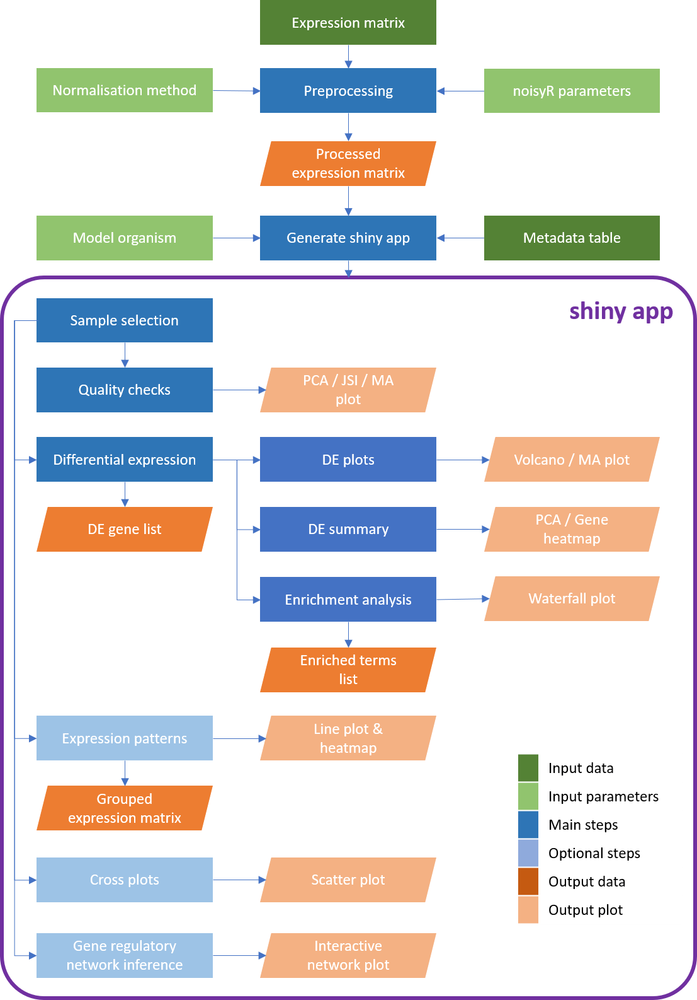
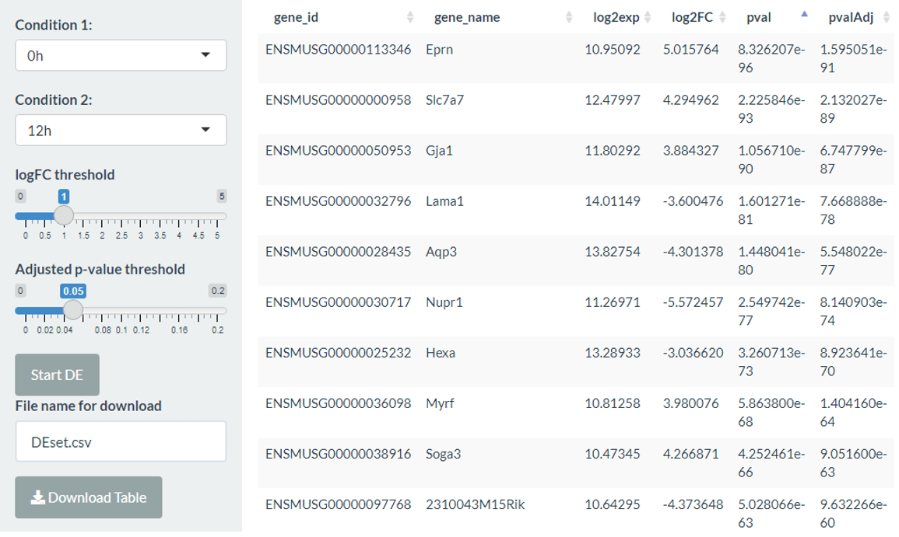
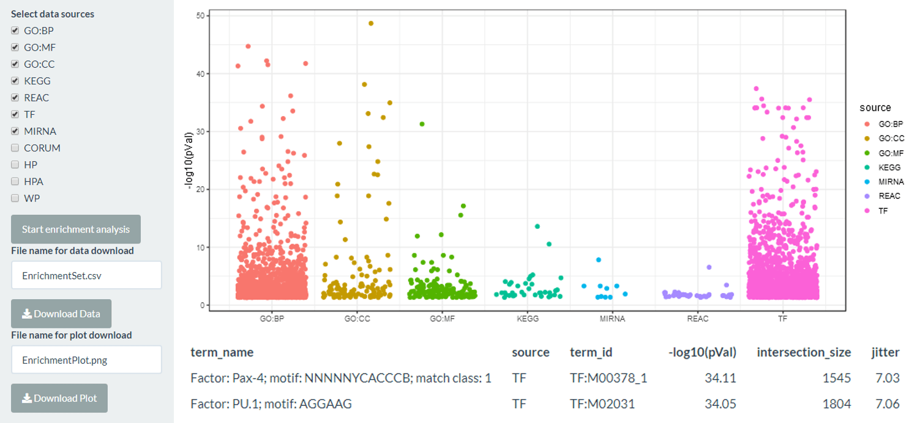
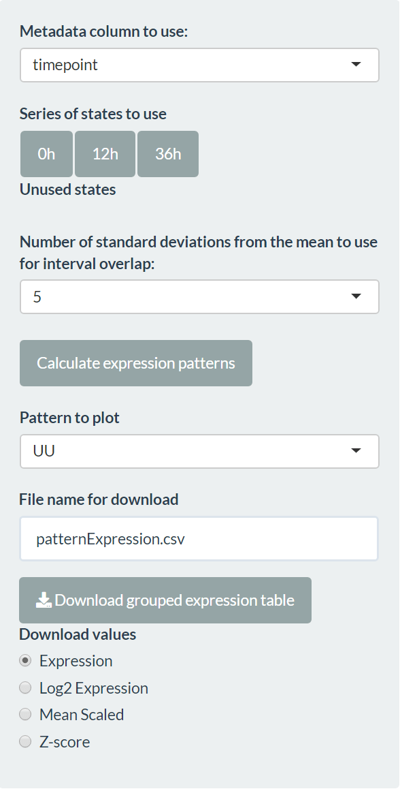
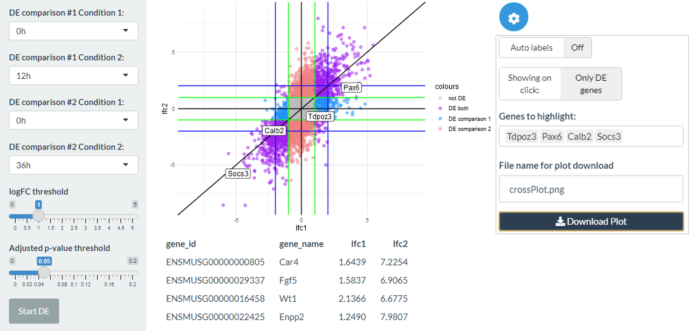
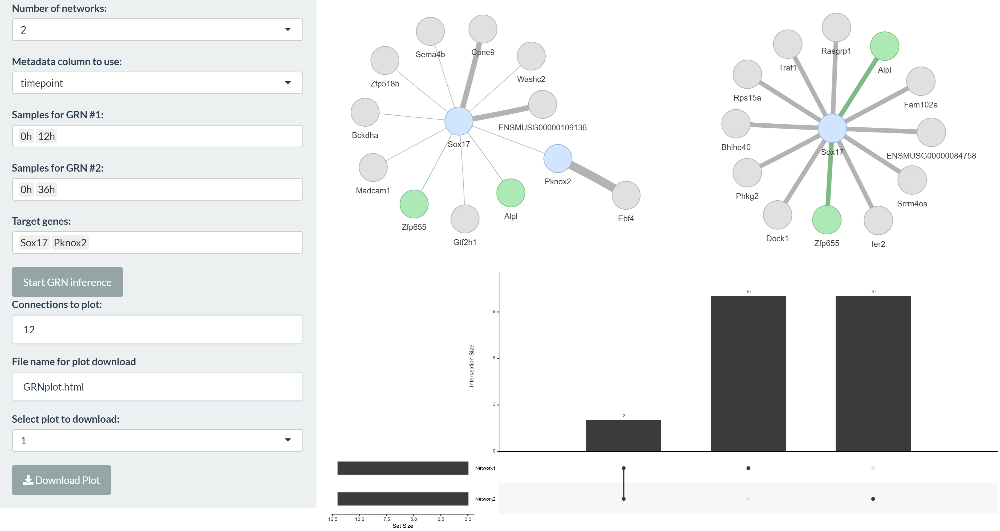

<div style="text-align: justify"> 

```{r options, include = FALSE}
knitr::opts_chunk$set(
  collapse = TRUE,
  comment = "##>"
)
```

Bulk mRNA-seq experiments are essential for exploring a wide range of biological questions. To bring the data analysis closer to its interpretation and facilitate both interactive, exploratory tasks and the sharing of (easily accessible) information, we present *bulkAnalyseR* an R package that offers a seamless, customisable solution for most bulk RNAseq datasets. By integrating state-of-the-art approaches without relying on extensive computational support, and replacing static images with interactive panels, our aim is to further support and strengthen the reusability of data. bulkAnalyseR enables standard analyses of bulk data, using an expression matrix as starting point. It presents the outputs of various steps in an interactive web-based interface, making it easy to generate, explore and verify hypotheses. Moreover, the app can be easily shared and published, incentivising research reproducibility and allowing others to explore the same processed data and enhance the biological conclusions.

```{r workflow, echo = FALSE, out.width = "80%"}
 
```

## Installation

To install the package, first install all CRAN dependencies:

```{r cran_install, eval=FALSE}
packages.cran <- c("ggplot2",
                   "shiny",
                   "shinythemes",
                   "gprofiler2",
                   "stats",
                   "ggrepel",
                   "utils",
                   "RColorBrewer",
                   "circlize",
                   "shinyWidgets",
                   "shinyjqui",
                   "dplyr",
                   "magrittr",
                   "ggforce",
                   "rlang",
                   "glue",
                   "matrixStats",
                   "noisyr",
                   "tibble",
                   "ggnewscale",
                   "ggrastr",
                   "visNetwork")
new.packages.cran <- packages.cran[!(packages.cran %in% installed.packages()[, "Package"])]
if(length(new.packages.cran))
  install.packages(new.packages.cran)
```

Then install bioconductor dependencies:

```{r bioc_install, eval = FALSE}
packages.bioc <- c("edgeR", 
                   "DESeq2",
                   "preprocessCore",
                   "AnnotationDbi",
                   "GENIE3",
                   "ComplexHeatmap")

new.packages.bioc <- packages.bioc[!(packages.bioc %in% installed.packages()[,"Package"])]
if(length(new.packages.bioc)){
  if (!requireNamespace("BiocManager", quietly = TRUE))
    install.packages("BiocManager")
  BiocManager::install(new.packages.bioc)
}
```

Finally, you can install the latest stable version of *bulkAnalyseR* from GitHub:

```{r github_install, eval = FALSE}
if (!requireNamespace("devtools", quietly = TRUE))
  install.packages("devtools")

devtools::install_github("Core-Bioinformatics/bulkAnalyseR")
```

## Preprocessing

First, load *bulkAnalyseR*:

```{r setup}
library(bulkAnalyseR)
```

### Loading an expression matrix

For this vignette we are using a subset of the count matrix for an experiment included in [a 2019 paper by Yang et al](https://www.sciencedirect.com/science/article/pii/S2405471219301152). Rows represent genes/features and columns represent samples:

```{r read}
counts.in <- system.file("extdata", "expression_matrix.csv", package = "bulkAnalyseR")
exp <- as.matrix(read.csv(counts.in, row.names = 1))
head(exp)
```

### Defining metadata

The subset of the dataset we are using has samples from 3 timepoints: 0h, 12h and 36h, each with 2 biological replicates. We define a metadata table detailing which sample correspond to which timepoint:

```{r metadata}
meta <- data.frame(
  srr = colnames(exp), 
  timepoint = rep(c("0h", "12h", "36h"), each = 2)
)
```

```{r convert type, include = FALSE, eval = FALSE}
meta$srr = as.character(meta$srr)
meta$timepoint = as.character(meta$timepoint)
```

This metadata table should be a data frame containing at minimum two columns: the first column must contain the column names of the expression.matrix, while the last column is assumed to contain the experimental conditions that will be tested for differential expression.

### Denoising and normalisation

Before using the expression matrix to create our shiny app, some preprocessing should be performed. *bulkAnalyseR* contains the function **preprocessExpressionMatrix** which takes the expression matrix as input then denoises the data using [*noisyR*](https://github.com/Core-Bioinformatics/noisyR) and normalises using either quantile (by default) or RPM normalisation (specified using *normalisation.method* parameter). By specifying *output.plot = TRUE*, you can also print the expression-similarity line plots from *noisyR* to console and you can specify further parameters from the noisyR [*noisyr_counts*](https://core-bioinformatics.github.io/noisyR/reference/noisyr_counts.html).

```{r preprocess,fig.width=7, fig.height=5}
exp.proc <- preprocessExpressionMatrix(exp, output.plot = TRUE)
```

It is not recommended to use data which has not been denoised and normalised as input to *generateShinyApp*. You can also perform your own preprocessing outside *preprocessExpressionMatrix*.

## Creating a shiny app

The central function in *bulkAnalyseR* is **generateShinyApp**. This function creates an app.R file and all required objects to run the app in .rda format in the target directory. The key inputs to **generateShinyApp** are *expression.matrix* (after being processed using *preprocessExpressionMatrix*) and *metadata*. You can also specify the title of the app (which will appear in the navigation bar at the top of the app) with *app.title*, the directory where the app should be saved with *shiny.dir* and the shiny theme you wish to use ('flatly' is the default, you can find the other options [here](https://rstudio.github.io/shinythemes/)). You also need to specify the organism on which your data was generated, firstly using the *organism* parameter using the *gprofiler2* naming convention e.g. 'hsapiens','mmusculus' (see [here](https://biit.cs.ut.ee/gprofiler/page/organism-list) for the full list of organisms and IDs), and secondly specifying the database for annotations to convert ENSEMBL IDs to gene names e.g. org.Hs.eg.db - the full list of bioconductor packaged databases can be seen using this command:

```{r bioconductor dbs}
BiocManager::available("^org\\.")
```

The dataset in this example was generated on *M. musculus* so we would generate the app using this function call (note that the org.Mm.eg.db needs to be installed):

```{r generate app, eval=FALSE}
generateShinyApp(
  expression.matrix = exp.proc,
  metadata = meta,
  shiny.dir = "shiny_Yang2019",
  app.title = "Shiny app for visualisation of three timepoints from the Yang 2019 data",
  organism = "mmusculus",
  org.db = "org.Mm.eg.db"
)
```

This will create a folder called *shiny_Yang2019* in which there will be 2 data files *expression_matrix.rda* and *metadata.rda* and *app.R* which defines the app. To see the app, you can call *shiny::runApp('shiny_Yang2019')* and the app will start. The app generated is standalone and can be shared with collaborators or published online through a platform like \href{https://www.shinyapps.io/}{shinyapps.io}. This provides an easy way for anyone to explore the data and verify the conclusions, increasing access and promoting reproducibility of the bioinformatics analysis.

By default, the app will have 9 panels: Sample select, Quality checks, Differential expression, Volcano and MA plots, DE summary, Enrichment, Expression patterns, Cross plots, GRN inference. You can choose to remove one or more panels using the *panels.default* parameter. 

```{r only QC and DE panels, eval = FALSE}
generateShinyApp(
  expression.matrix = exp.proc,
  metadata = meta,
  shiny.dir = "shiny_Yang2019_onlyQC_DE",
  app.title = "Shiny app for visualisation of three timepoints from the Yang 2019 data",
  organism = "mmusculus",
  org.db = "org.Mm.eg.db",
  panels.default = c('QC','DE')
)
```

See the following sections for more details about the default panels:

### Sample Select

This tab allows you to select a subset of samples to use for the analysis. In particular this allows you to exclude low quality samples (which you could discover using QC tab) or focus on particular parts of the data. Once you have selected the samples you want, make sure to press the 'Use the selected sample!' button to confirm your choice. If you do not use this button or select samples then all samples will be used.

```{r sample select, echo = FALSE, out.width = "80%"}
 
```

### Quality check (QC)

The Quality Check (QC) tab includes a Jaccard Similarity Index (JSI) heatmap, and a PCA dimensionality reduction, with groups based on the metadata information. This enables a high-level overview of the similarity across samples, usually reflecting the experimental design quite closely and serving as a sanity check. Within this panel, there is also the option to show the MA plot between any 2 columns - this can be used to further investigate any sample similarity or differences found through the JSI and PCA plots.

#### Jaccard Similarity Index

Within the JSI plot, you can change the order of samples using an ordering of metadata columns as well as specifying the number of top abundance genes that should be used to calculate the JSI. Finally, you can choose whether JSI values should be shown on the heatmap.

```{r JSI, echo = FALSE, out.width = "80%"}
knitr::include_graphics("figures/JSI.png") 
```

#### PCA

The PCA plot can be created for a chosen number of top abundance genes and coloured by the metadata attribute selected. The sample labels and ellipses around groups can also be included or removed.

```{r PCA, echo = FALSE, out.width = "80%"}
knitr::include_graphics("figures/PCA.png") 
```

#### MA plots

The third part of the QC tab allows you to create MA plots comparing any two samples. You could, for example, use these plots to compare replicates - these would be expected to show a close funneling shape.

```{r MA QC, echo = FALSE, out.width = "80%"}
knitr::include_graphics("figures/MA_QC.png") 
```

### Differential expression (DE)

The differential expression (DE) tab can be used to compare any of the conditions from the columns of the metadata table using the edgeR or DESeq2 packages with customisable parameters (log2 fold change and adjusted p-value threshold). The output is a list of differentially expressed genes along with log2 fold changes and adjusted p-values. Within the app, the differentially expressed genes can be explored using an interactive table (sorted by absolute log2 fold change) and this can also be saved as a comma-separated file.

```{r DE, echo = FALSE, out.width = "80%"}
 
```

In this tab, you can also select genes of interest by clicking on the table, which can be used in the DE summary and Volcano/MA tabs. There is also a button to choose the top 50 DE genes (by absolute log2 fold change) or reset the selection.

### Volcano/MA plots

Assuming differential expression has been performed, the Volcano/MA panel then visualises the DE genes, allowing interactive exploration of the data by searching for specific genes of interest or using the selected top DE genes and clicking on genes on the plot itself to gain more information and generate hypotheses. 

#### Volcano plots

Volcano plots show log2 fold change against log10 BH-adjusted p-value. The DE points are shown in blue with their colour proportional to the log2 expression of the gene. Green and blue guide lines show the DE thresholds and twice the DE thresholds respectively. 

```{r volcano, echo = FALSE, out.width = "80%"}
knitr::include_graphics("figures/VolcanoPlot.png") 
```

#### MA plots

The DE MA plots show log2 expression levels against log2 fold change for each gene. The DE points are shown in blue with their colour proportional to the log2 expression of the gene. Green and blue guide lines show the DE thresholds and twice the DE thresholds respectively. 

```{r MA DE, echo = FALSE, out.width = "80%"}
knitr::include_graphics("figures/MAPlot.png") 
```


### DE summary

The DE summary panel allows further visualisation using the genes called DE or selected by the user in the DE panel.

#### Post-differential expression PCA

Firstly, we can create a PCA using only the DE genes or using the selected genes from the DE panel. You can also create the PCA on only the user-selected DE genes by deselecting the 'Use all DE?' option. As in the QC PCA plot, you can colour points by your chosen metadata columns and add/remove sample labels and group ellipses.

```{r PCA DE, echo = FALSE, out.width = "80%"}
 
```

#### Expression heatmap

Secondly, we can create heatmaps for expression levels (raw expression level, log2 expression level or Z-score) of selected genes. By default the top 50 DE genes are used, but if users select genes in the DE panel then these are used instead. Also, further genes can be added by name in the Additional genes box. As in the JSI, you can change the order of samples using an ordering of metadata columns.

```{r heatmap, echo = FALSE, out.width = "80%"}
knitr::include_graphics("figures/ExpressionHeatmap.png") 
```

### Enrichment

The enrichment tab uses the differentially expressed genes to run an enrichment analysis using g:profiler with a user selected output of the standard GO terms, the KEGG and reactome pathway databases, and miRNA and transcription factor lists. The plot shows the log10 BH-corrected p-value for each term, separated by category. The background set used is all the genes in the expression matrix - if noisyR preprocessing is used then this will be all the genes above the s/n threshold.

The output is both the results table from g:profiler which can be downloaded as well as a jitter plot which can be clicked to identify the most significant terms.

```{r enrichment, echo = FALSE, out.width = "80%"}
 
```

### Expression patterns

The expression pattern tab allows the creation of expression patterns to identify potential genes of interest across a variety of conditions. The most common application of this is a time series, but it could be suitable for another logical progression between conditions. To define the series, the user must select a column of the metadata and drag states into the "Series of states to use" area.

The pattern identification is done by calculating a confidence interval for each gene in each condition, using all samples in that condition and the number of standard deviations away from the mean provided. The pattern between two consecutive conditions is defined as straight (S) if the intervals overlap and up (U) or down (D) if they don't. The full expression pattern is the concatenation of individual patterns (for example, "UUS" for 4 conditions).

The grouped expression matrix can then be downloaded, showing which pattern each gene was assigned to. Plots are also created for the genes in the selected pattern ("Pattern to plot").

```{r patterns, echo = FALSE, out.width = "80%"}
 
```

#### Pattern line plot

A line plot is shown with the mean expression of the genes assigned to the chosen pattern in each condition. The expression values are mean-scaled by default. A legend is shown if less than 10 genes are present.

```{r patternLine, echo = FALSE, out.width = "80%"}
 
```

#### Pattern expression heatmap

A heatmap is shown with the mean expression of the genes assigned to the chosen pattern in each condition. The expression values are z-score transformed by default. Gene names are shown if less than 50 genes are present.

```{r patternHeatmap, echo = FALSE, out.width = "80%"}
 
```

### Cross plots

The cross plot tab allows you to compare two differential expression analyses against each other, for example two comparisons of interest or the same comparison using edgeR and DESeq2. The plot shows the log2 fold change of the two differential expression calls on each axis. Genes which are DE in both comparisons are coloured purple, in comparison 1 but not comparison 2 in blue and in comparison 2 but not comparison 1 in red. You can label selected genes and click on genes on the plot itself to gain more information and generate hypotheses. 

```{r cross, echo = FALSE, out.width = "80%"}
 
```

### Gene regulatory networks (GRN)

The GRN tab enables the creation of small gene regulatory networks (GRNs) to facilitate further exploration and hypothesis generation based on genes of interest. Target genes can be selected and a small network with them as targets can be generated by clicking the "Start GRN inference" button. The number of regulators can then be adjusted and the plot downloaded in interactive html format. Note that target genes can also regulate each other if the selected genes are functionally similar.

```{r GRN, echo = FALSE, out.width = "80%"}
 
```

### Adding extra panels

Alongside the default 8 panels, you can also define your own panels and add them to the app. As an example, we could add an extra QC panel (in this case it will be exactly the same):

```{r add extra panel, eval = FALSE}
generateShinyApp(
  expression.matrix = exp.proc,
  metadata = meta,
  shiny.dir = "shiny_Yang2019_ExtraQC",
  app.title = "Shiny app for visualisation of three timepoints from the Yang 2019 data - extra QC",
  organism = "mmusculus",
  org.db = "org.Mm.eg.db",
  panels.extra = tibble::tibble(
    UIfun = "QCpanelUI", 
    UIvars = "'QC2', metadata", 
    serverFun = "QCpanelServer", 
    serverVars = "'QC2', expression.matrix, metadata"
  )
)
```

If you need to add extra data or package imports for the extra panel(s) then you can do this using the *data.extra* and *packages.extra* parameters. Make sure you have the extra data loaded when you create the app. For example:

```{r add extra data, eval = FALSE}

extra.data1 = matrix(rnorm(36),nrow=6)
extra.data2 = matrix(rnorm(60),nrow=10)

generateShinyApp(
  expression.matrix = exp.proc,
  metadata = meta,
  shiny.dir = "shiny_Yang2019_ExtraData",
  app.title = "Shiny app for visualisation of three timepoints from the Yang 2019 data - extra QC",
  organism = "mmusculus",
  org.db = "org.Mm.eg.db",
  panels.extra = tibble::tibble(
    UIfun = "QCpanelUI", 
    UIvars = "'QC2', metadata", 
    serverFun = "QCpanelServer", 
    serverVars = "'QC2', expression.matrix, metadata"
  ),
  data.extra = c("extra.data1", "extra.data2"),
  packages.extra = "somePackage",
)

```


